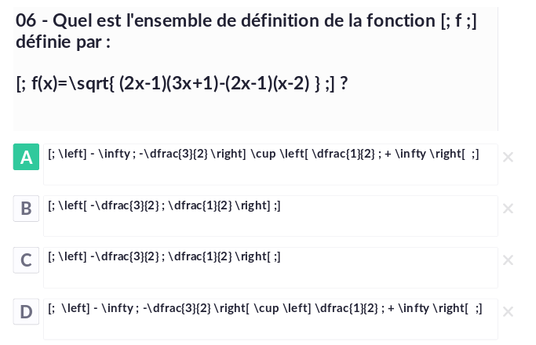
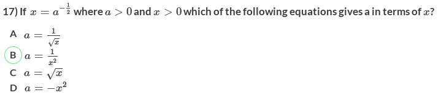

# TeXify-Plickers
 TeXify-Plickers allows you to include mathematics in [Plickers](https://plickers.com) questions. Is not a formula editor, LaTeX language must be known. Based on [MathJax](https://www.mathjax.org/) technology.

## Installation and usage

You can include mathematics to plickers using a user-script or a firefox addon.

### Use a user script

* 1) install [GreaseMonkey for FireFox](https://addons.mozilla.org/fr/firefox/addon/greasemonkey/) or [Tampermonkey for Chrome](https://chrome.google.com/webstore/detail/tampermonkey/dhdgffkkebhmkfjojejmpbldmpobfkfo);
* 2) install [TeXify-Plickers user script](https://raw.githubusercontent.com/obook/TeXify-Plickers/master/user-script/TeXify-Plickers.user.js);

### Use the FireFox Addon

* install [FireFox Addon](https://github.com/obook/TeXify-Plickers/blob/master/firefox-addon/texifyplickers-0.0.8-an%2Bfx.xpi)

Then, create questions and use delimiters **$$** and **$$** or **[;** and **;]** (inline) for insert LaTeX code.

## Sample



### Live view result



## Known Bugs

### tampermonkey for Dolphin

Under tampermonkey for Dolphin (Android), the @include directive is buggy. You must change the script line

```
// @include	https://plickers.com/*
```
to

```
// @include	*
```

#### Picture of question is inserted after choices.
*************************************************************************************************************


