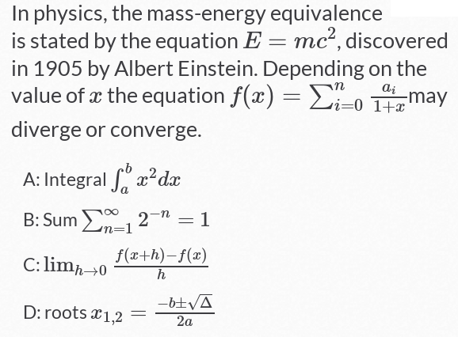

# TeXify-Plickers
 This script allows you to include mathematics in [Plickers](https://plickers.com) questions. Is not a formula editor, LaTeX language must be known. Library used : the JavaScript display engine [MathJax](https://www.mathjax.org/).

### Installation and usage

* 1) install [GreaseMonkey for FireFox](https://addons.mozilla.org/fr/firefox/addon/greasemonkey/) or [Tampermonkey for Chrome](https://chrome.google.com/webstore/detail/tampermonkey/dhdgffkkebhmkfjojejmpbldmpobfkfo);
* 2) install [TeXify-Plickers user script](https://raw.githubusercontent.com/obook/TeXify-Plickers/master/user-script/TeXify-Plickers.user.js);
* 3) Create questions and use delimiters **$$** and **$$** or **[;** and **;]** (inline) for insert LaTeX code.

### Sample

```
In physics, the mass-energy equivalence is stated by the equation [; E=mc^2 ;], discovered in 1905 by Albert Einstein. Depending on the value of  [; x ;] the equation  [;  f(x) = \sum_{i=0}^{n} \frac{a_i}{1+x} ;] may diverge or converge.

A: Integral [;  \int_{a}^{b} x^2 dx ;]
B: Sum [; \sum_{n=1}^{\infty} 2^{-n} = 1 ;]
C: [;  \lim_{h \rightarrow 0 } \frac{f(x+h)-f(x)}{h}  ;]
D: roots [; x_{1,2} = \frac{- b \pm \sqrt{\Delta}}{2a} ;]
```

### Live view result



### Known Bugs

#### tampermonkey for Dolphin

Under tampermonkey for Dolphin (Android), the @include directive is buggy. You must change the script line

```
// @include	https://plickers.com/*
```
to

```
// @include	*
```

#### picture of question is inserted after choices.


