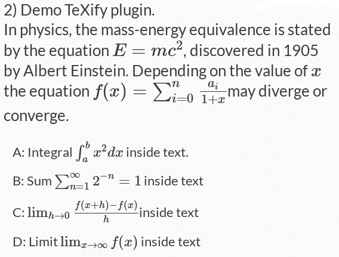

# TeXify-Plickers
 GreaseMonkey user script for add LaTeX code in Plickers website. This plugin is not a formula editor, LaTeX language must be known. The library used : [MathJax](https://www.mathjax.org/).

### Installation

* 1) install [GreaseMonkey extension for FireFox](https://addons.mozilla.org/fr/firefox/addon/greasemonkey/)
* 2) install [TeXify-Plickers user script](https://github.com/obook/TeXify-Plickers/raw/master/TeXify-Plickers.user.js)
* 3) Create questions and use delimiters [; and ;] for insert LaTeX code.

### Result



### Sample question

```
2) Demo TeXify plugin. 
In physics, the mass-energy equivalence is stated by the equation [; E=mc^2 ;], discovered in 1905 by Albert Einstein. Depending on the value of  [; x ;] the equation  [;  f(x) = \sum_{i=0}^{n} \frac{a_i}{1+x} ;] may diverge or converge.

A: Integral [;  \int_{a}^{b} x^2 dx ;] inside text.
B: Sum [; \sum_{n=1}^{\infty} 2^{-n} = 1 ;] inside text
C: [;  \lim_{h \rightarrow 0 } \frac{f(x+h)-f(x)}{h}  ;]  inside text
D: Limit [; \lim_{x\to\infty} f(x) ;] inside text
```
