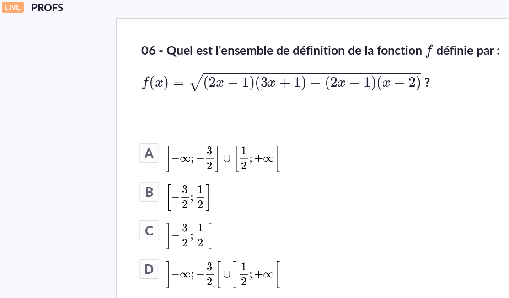

# TeXify-Plickers
 TeXify-Plickers allows you to include mathematics in [Plickers](https://plickers.com). Is **NOT** a formula editor; LaTeX, MathML or AsciiMath notation language must be known. Is based on [MathJax](https://www.mathjax.org/) technology.

## Installation and usage

1. install [ViolentMonkey for FireFox >=57.0](https://addons.mozilla.org/en-US/firefox/addon/violentmonkey/) or [ViolentMonkey for Chrome](https://chrome.google.com/webstore/detail/violentmonkey/jinjaccalgkegednnccohejagnlnfdag);
2. install [TeXify-Plickers user script](https://raw.githubusercontent.com/obook/TeXify-Plickers/master/user-script/TeXify-Plickers.user.js).

### Usage
Then, create questions and use delimiters **[;** and **;]** (inline) or **$$** and **$$** for insert math code.

## Sample

Live view result

## Security considerations

TeXify-Plickers use script = createElement("script") and document.head.appendChild(script) to add mathjax javascript library from [hardcoded link of MathJax Content Delivery Network (CDN) ](https://cdnjs.cloudflare.com/ajax/libs/mathjax/2.7.1/MathJax.js?config=TeX-MML-AM_CHTML). This is secure until cloudflare CDN and your DNS are not compromised.

*************************************************************************************************************

